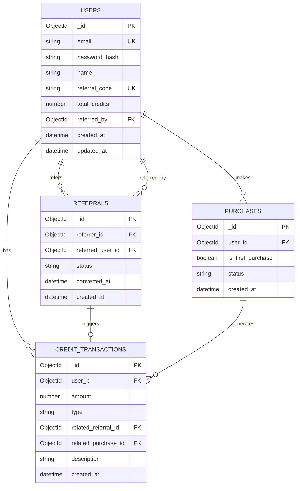

# Database Design - FileSure Referral System

## Collections Overview

The system uses 4 main collections:
1. **users** - User accounts and authentication
2. **referrals** - Referrer-referee relationships
3. **purchases** - Purchase simulation records
4. **credit_transactions** - Credit allocation audit trail

## Entity Relationship Diagram


## Relationships

### One-to-Many Relationships

1. **User → Referrals (as referrer)**
   - One user can refer many users
   - `referrals.referrer_id` references `users._id`

2. **User → Referrals (as referee)**
   - One user can be referred by one user
   - `referrals.referred_user_id` references `users._id`

3. **User → Purchases**
   - One user can make many purchases
   - `purchases.user_id` references `users._id`

4. **User → Credit Transactions**
   - One user can have many transactions
   - `credit_transactions.user_id` references `users._id`

### Business Rules

1. **User cannot refer themselves**
   - Validation: `referrals.referrer_id !== referrals.referred_user_id`

2. **User can only be referred once**
   - Unique index on `referrals.referred_user_id`

3. **Credits only on first purchase**
   - Check `purchases.is_first_purchase` before allocating

4. **Fixed credit amounts**
   - Referrer: exactly +2 credits
   - Referee: exactly +2 credits

5. **Referral status updates**
   - Status changes from "pending" to "converted" on first purchase
   - `converted_at` timestamp added


## Performance Optimization

### Indexes Strategy
```javascript
// Users collection
db.users.createIndex({ email: 1 }, { unique: true })
db.users.createIndex({ referral_code: 1 }, { unique: true })
db.users.createIndex({ referred_by: 1 })

// Referrals collection
db.referrals.createIndex({ referrer_id: 1, status: 1 })
db.referrals.createIndex({ referred_user_id: 1 }, { unique: true })
db.referrals.createIndex({ created_at: -1 })

// Purchases collection
db.purchases.createIndex({ user_id: 1 })
db.purchases.createIndex({ user_id: 1, is_first_purchase: 1 })
db.purchases.createIndex({ created_at: -1 })

// Credit Transactions collection
db.credit_transactions.createIndex({ user_id: 1, created_at: -1 })
db.credit_transactions.createIndex({ type: 1 })
```


