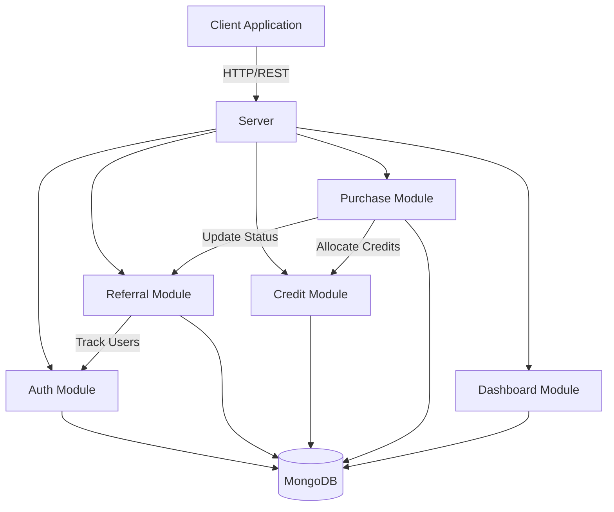
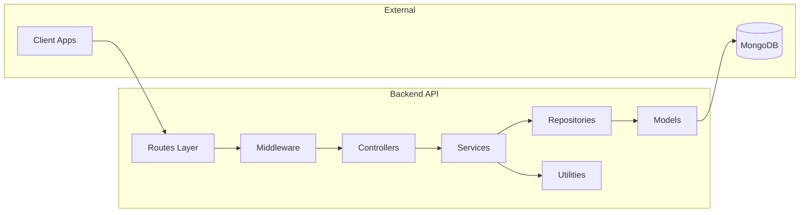
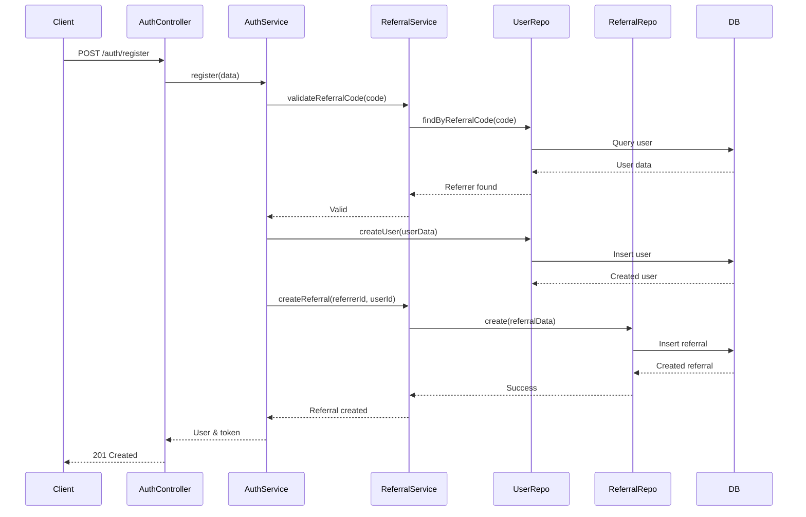
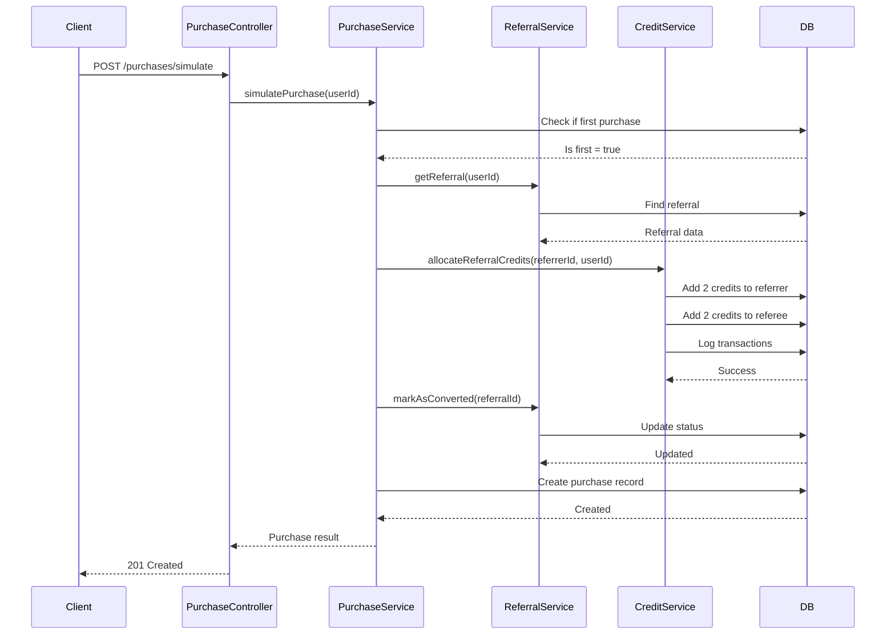

# System Architecture - FileSure Referral System

## Overview

The system follows a modular, layered architecture with clear separation of concerns. Built using Node.js/Express with TypeScript, MongoDB for data persistence, and follows SOLID principles.

## High-Level Architecture



## Architecture Layers

### 1. Presentation Layer (API Routes)

- Handle HTTP requests/responses
- Route management (`/api/v1/*`)
- Request validation
- Authentication middleware
- Rate limiting

### 2. Controller Layer

- Receive requests from routes
- Delegate to service layer
- Format responses
- Handle HTTP-specific logic

### 3. Service Layer (Business Logic)

- Core business rules
- Data validation
- Cross-module communication
- Transaction management
- Credit calculation logic

### 4. Repository Layer (Data Access)

- Database operations
- Query optimization
- Model interactions
- Data transformation

### 5. Data Layer (MongoDB)

- Document storage
- Indexes for performance
- Data persistence

## Component Diagram



## Module Structure

Each module follows this pattern:

```
module/
├── module.controller.ts    # Handle HTTP
├── module.service.ts       # Business logic
├── module.repository.ts    # Data access
├── module.routes.ts        # Route definitions
├── module.dto.ts           # Data transfer objects
├── module.interface.ts     # TypeScript interfaces
└── module.validator.ts     # Request validation schemas
```

## Data Flow

### Registration with Referral Flow



### First Purchase Credit Allocation Flow



## Technology Stack

### Backend

- **Runtime:** Node.js 20.x
- **Framework:** Express.js
- **Language:** TypeScript
- **Database:** MongoDB with Mongoose ODM
- **Authentication:** JWT + bcrypt

### Libraries

- **Validation:** Zod
- **Logging:** Winston
- **Rate Limiting:** express-rate-limit
- **Security:** helmet, cors
- **Environment:** dotenv

## Security Architecture

### Authentication Flow

1. User submits credentials
2. Server validates and hashes password (bcrypt)
3. JWT token generated with user payload
4. Token sent to client
5. Client includes token in subsequent requests
6. Middleware verifies token on protected routes

### Security Measures

- Password hashing with bcrypt (10 rounds)
- JWT with expiration (24h access, 7d refresh)
- Rate limiting on all endpoints
- Input validation using Zod schemas
- CORS configured for specific origins
- Helmet for security headers
- MongoDB injection prevention via Mongoose

## Scalability Considerations

### Current Architecture

- Modular design allows independent scaling
- Stateless API (can run multiple instances)
- MongoDB indexes for query performance

### Future Enhancements

- Redis for session management
- Message queue for async operations
- Microservices separation
- Load balancing
- Caching layer

## Error Handling Strategy

```
Request → Validation Middleware → Controller → Service
                ↓                      ↓          ↓
            Validation Error     HTTP Error    Business Error
                ↓                      ↓          ↓
         Global Error Handler ←────────┴──────────┘
                ↓
        Formatted Response → Client
```

## Deployment Architecture

```
GitHub Repository
    ↓ (CI/CD Pipeline)
GitHub Actions
    ↓ (Build & Test)
Docker Image
    ↓ (Deploy)
Render Platform
    ↓ (Connect)
MongoDB Atlas
```

## API Versioning

All endpoints prefixed with version:

- `/api/v1/*` - Current version
- Future: `/api/v2/*` for breaking changes

## Monitoring & Logging

- Winston logger for structured logs
- Different log levels (error, warn, info, debug)
- Request logging middleware
- Error tracking and reporting
- Health check endpoint: `/api/v1/health`

## Design Principles Applied

### SOLID Principles

- **S**ingle Responsibility: Each class has one job
- **O**pen/Closed: Open for extension, closed for modification
- **L**iskov Substitution: Subtypes are substitutable
- **I**nterface Segregation: Many specific interfaces
- **D**ependency Inversion: Depend on abstractions

### Other Principles

- DRY (Don't Repeat Yourself)
- KISS (Keep It Simple, Stupid)
- Separation of Concerns
- Dependency Injection
- Repository Pattern
